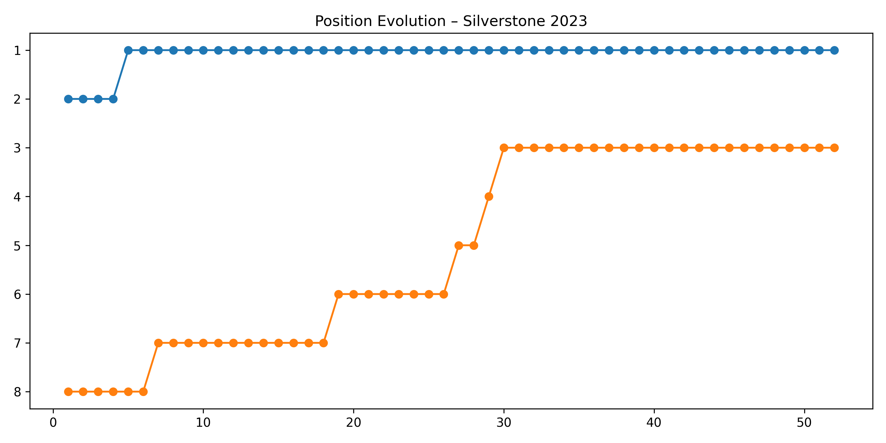
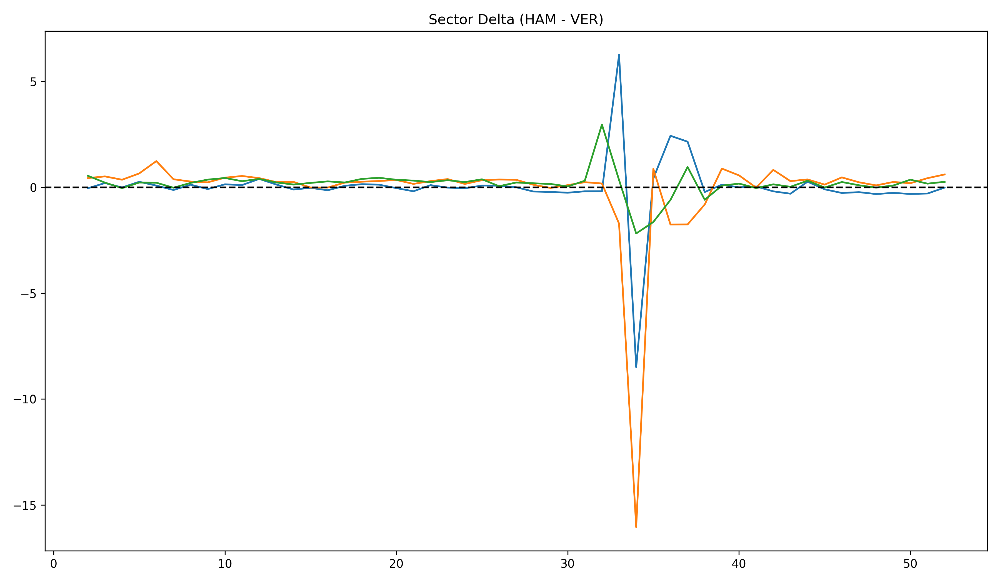
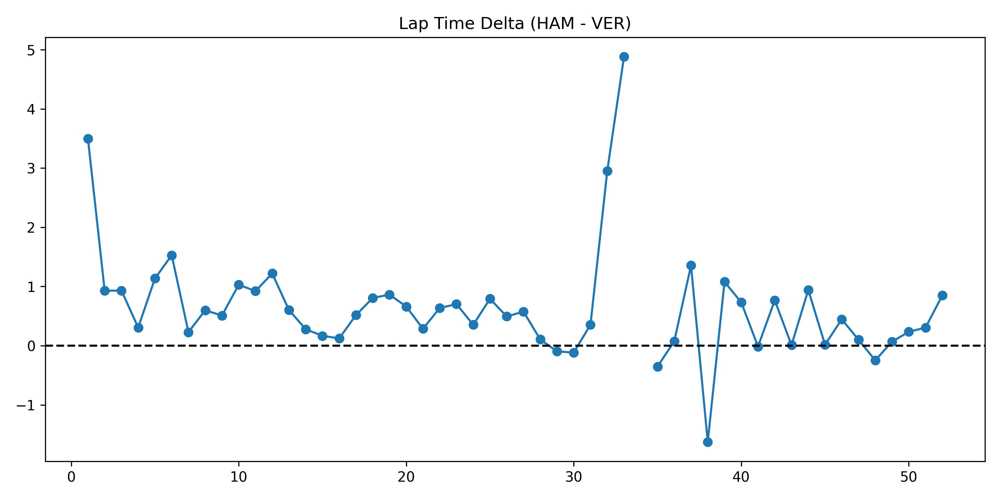
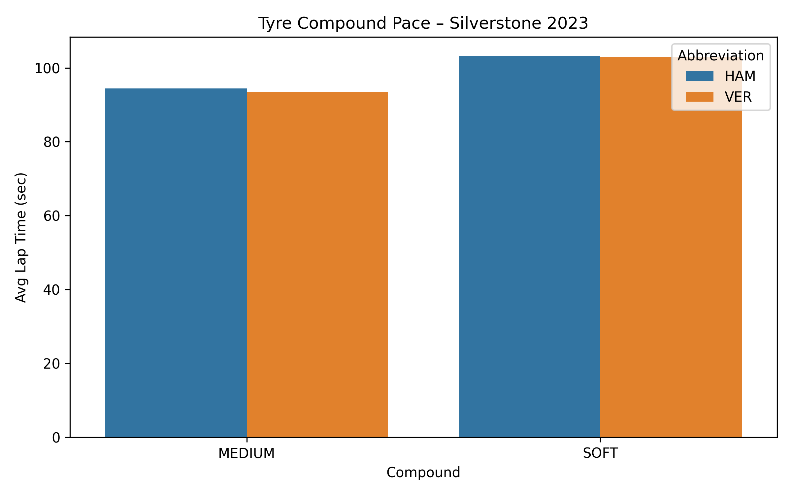
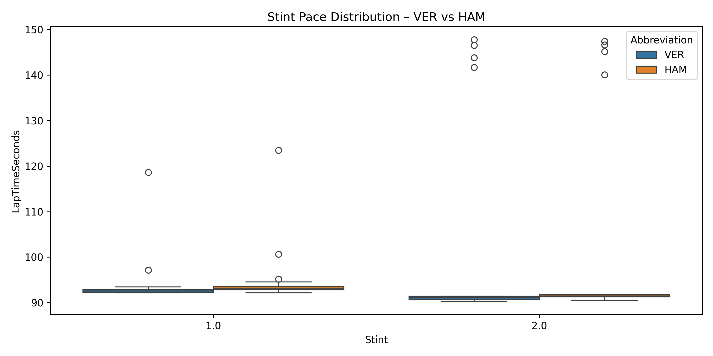
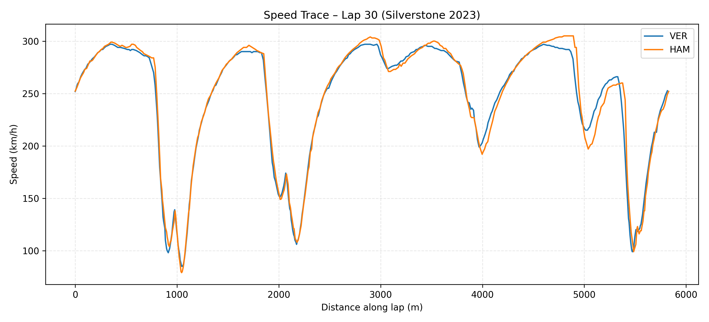
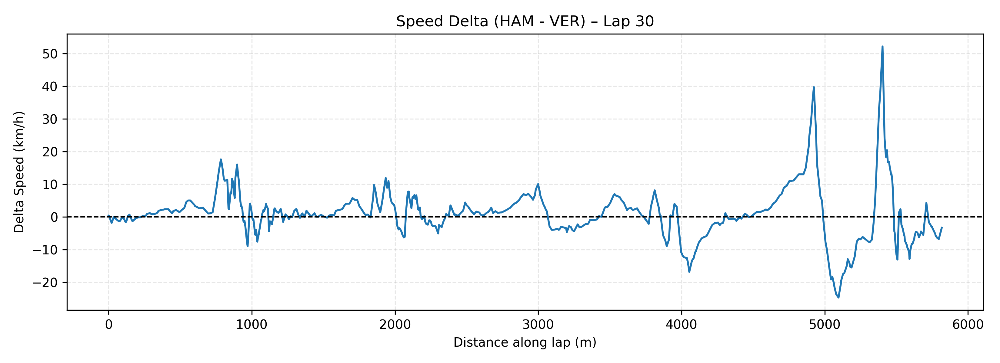

<p align="center">
  
</p>

# 🏎️ Formula 1 Race Strategy Analytics
**End-to-End Data Analytics Project (SQL | Python | Power BI | Tableau | FastF1)**

## 🎯 Project Goal
Analyze Formula 1 race, qualifying, and lap data to uncover **how driver performance, team strategies, and pit-stop timing influence race outcomes** — and present findings through **clean insights, visuals, and dashboards**.

## 💡 Objectives
- Clean, structure, and integrate multi-source F1 datasets (Ergast API, Kaggle CSVs, FastF1).
- Perform SQL-based exploratory analysis on races, drivers, constructors, and circuits.
- Visualize **driver consistency, qualifying vs. race performance, pit-stop strategy**, and telemetry insights.
- Provide actionable insights for a “team principal” or strategist.
- Deliver a professional analytics case study with code, queries, visuals, and reports.

## 🧩 Key Questions Explored
1. Which drivers and teams are most consistent across seasons?
2. How strong is the correlation between qualifying and final race position?
3. How much time is gained or lost through pit-stop strategy?
4. Which circuits favor which teams or drivers?
5. What is the impact of pitting under Safety Car vs. green flag conditions?

## 🗂️ Project Structure
> All analysis code is available inside the `notebooks/` directory, with each step of the workflow clearly documented and reproducible.

```

f1-analytics-portfolio/
│
├─ data/                     # CSVs or API extracts (drivers, races, results, telemetry)
├─ notebooks/
│   ├─ 01_data_import_and_cleaning.ipynb
│   ├─ 02_exploratory_analysis.ipynb
│   ├─ 03_fastf1_silverstone_2023_analysis.ipynb
│
├─ sql/
│   ├─ schema.sql
│   ├─ queries.sql
│
├─ dashboard/
│   ├─ power_bi/
│   ├─ powerbi_layout.md
│
├─ reports/
│   ├─ executive_summary.md
│   ├─ slide_deck.pdf
│
├─ PROJECT_LOG.md
├─ README.md
└─ requirements.txt
```

## 🛠️ Tech Stack
| Category | Tools / Libraries |
|-----------|-------------------|
| Data Ingestion | Python (pandas, requests), FastF1, Ergast API |
| Database | SQLite (demo), PostgreSQL (future) |
| Analysis | SQL, pandas, numpy |
| Visualization | Power BI, Tableau, Matplotlib, Plotly |
| Reporting | Markdown, PDF, PowerPoint |

## 🔍 Data Sources
- **Ergast API** — historical results, qualifying, pit stops, lap times  
- **FastF1 Library** — timing, tyre, stint, and telemetry data  
- **Kaggle Datasets** — precompiled CSVs for offline use

### 📄 Processed Data (Generated)
- `sector_deltas_ver_ham.csv`
- `lap_deltas_ver_ham.csv`
- `racecraft_laps_ver_ham.csv`
- `racecraft_summary_ver_ham.csv`


## 📓 Silverstone 2023 — Tyre & Stint Insights (VER vs HAM)
This project includes targeted analysis of the **2023 British Grand Prix (Silverstone)**, comparing **Max Verstappen (VER)** and **Lewis Hamilton (HAM)**.

### 🔹 Tyre Compound Pace
- Computed average & median lap times by tyre compound (Soft / Medium / Hard)
- Visual comparison of compound performance for both drivers
- VER showed superior average pace across tyre types

### 🔹 Stint-Level Performance
- Boxplots reveal lap-time distribution per stint
- VER displayed lower variance → higher consistency
- HAM exhibited greater fluctuation indicating tyre drop or traffic periods

### 🔹 Why This Matters
- Shows relative tyre management ability  
- Helps quantify race pace consistency  
- Forms the foundation for the upcoming **Driver Scouting Scorecard**

## 📸 Sample Visuals from the Analysis

Below are selected visuals from the Silverstone 2023 (VER vs HAM) race analysis to demonstrate pace, strategy, and driver performance differences.

### 🏁 Position Evolution — VER vs HAM (Silverstone 2023)
<p align="center">
  
</p>

### 🟦 Sector Delta Comparison (HAM – VER)
<p align="center">
  
</p>

### 🟥 Lap Time Delta (HAM – VER)
<p align="center">
  
</p>

### 🟨 Tyre Compound Pace (Average Lap Times)
<p align="center">
  
</p>

### 🟩 Stint Consistency Boxplots
<p align="center">
  
</p>

## 📡 Telemetry Insights – Silverstone 2023 (VER vs HAM)

Using FastF1 telemetry, the project compares **Max Verstappen and Lewis Hamilton** on a selected race lap at Silverstone 2023.

### 🔹 Speed Trace Overlay
<p align="center">
  
</p>

- Shows how VER and HAM differ in **corner entry, mid-corner, and exit speeds**.
- Highlights where one driver is more confident on turn-in or maintains higher minimum speed.

### 🔹 Speed Delta by Distance (HAM – VER)
<p align="center">
  
</p>

- Positive delta ⇒ HAM faster at that point on track  
- Negative delta ⇒ VER faster  
- Allows **corner-by-corner performance comparison** and ties together:
  - Car setup differences  
  - Tyre state  
  - Driving style  

These telemetry insights complement the lap/sector delta analysis and support a **driver scouting and race engineering perspective**, not just pure statistics.

📡 How to Read F1 Telemetry Plots (Engineer-Level Guide)

Understanding telemetry is essential in Formula 1 because it reveals where and why one driver is faster than another.
This project uses FastF1 telemetry data (speed, distance, sectors) to compare Max Verstappen (VER) and Lewis Hamilton (HAM) during the 2023 British Grand Prix.

This section explains how to interpret the telemetry plots included in this repository so that even non-technical readers can follow the engineering analysis.

🏎️ 1. Speed Trace Overlay (Speed vs Distance)

The speed trace shows how a driver brakes, corners, and accelerates through the lap.

<p align="center">  </p>
🔍 What to look for
A. Braking Zones (sharp downward slopes)

A steep drop = hard or late braking
A smooth drop = earlier or more controlled braking

Example interpretation:

If HAM’s curve drops later → HAM brakes later / more aggressively

If VER’s drop is smoother → VER manages the entry more progressively

B. Apex Speeds (lowest point in the curve)

This shows mid-corner grip and rotation.

Example interpretation:

If VER’s minimum speeds are higher → VER carries more mid-corner speed

If HAM’s line sits higher at certain corners → Mercedes stronger in that section

C. Corner Exit (where the curve rises after the apex)

Shows traction and throttle application.

Example interpretation:

VER’s trace rising earlier → better traction or earlier throttle

HAM accelerating sooner → stronger exit grip or deployment

D. Straights (flat or gently rising areas)

Peak speeds indicate top-end performance.

Example interpretation:

Higher peak speed = lower drag / better ERS

HAM faster on straights → Mercedes aero efficiency

VER faster → Red Bull’s lower drag philosophy

📉 2. Speed Delta Plot (HAM – VER)
<p align="center">  </p>

The delta plot shows directly which driver is faster at each part of the track.

Positive delta (above zero) → HAM faster

Negative delta (below zero) → VER faster

🔍 What patterns reveal
A. Time Gain / Loss

Rising delta → HAM gaining

Falling delta → VER gaining

B. Corner Characteristics

Deep dips at corner exits → VER traction advantage

Sharp spikes at braking zones → HAM braking confidence

Flat positive regions → HAM straight-line advantage

Sustained negative regions → VER corner-to-corner momentum

🧠 Why This Analysis Matters

Telemetry reveals the exact reason behind lap time differences:

Where does each driver gain or lose time?

Is the advantage from braking, apex speed, or traction?

Are the differences caused by setup, driving style, or tyre condition?

This type of analysis mirrors how F1 teams evaluate:

Driver performance

Car balance

Setup options

Strategy decisions

Including telemetry in your portfolio demonstrates race engineering-level analytical thinking, far beyond basic data visualization.

📘 Coming Soon

Future telemetry enhancements planned for this project:

Corner labels (Turn 1–18 overlays)

Throttle & brake traces

Gear usage comparison

ERS deployment mapping

Driver performance scoring framework

## 🖥️ Deliverables
- 🧮 Clean database (`data/f1.db`)  
- 🗃️ SQL queries and analytical scripts  
- 📓 Jupyter Notebooks (cleaning, EDA, FastF1 analysis)  
- 📈 Power BI dashboard layout (`dashboard/powerbi_layout.md`)  
- 🧾 Executive summary & slide deck  

## 🔎 Exploratory Data Analysis (SQL-First)
**Update — November 2025**

The SQL-focused notebook (`02_exploratory_analysis.ipynb`) includes:
- Wins per driver  
- Average points per driver  
- Positions gained (grid vs finish)  
- Pit-stop durations by team  
- Grid vs finish correlation (Pearson & Spearman)  
- Circuit performance summaries  
- Clean, reproducible Matplotlib charts  

This demonstrates strong **SQL analytical thinking** and supports future dashboard integration.

## 🧠 Example Insights
> - **Early pit-stop advantage**: Drivers pitting before lap 15 gained +0.7 positions on average.  
> - **Qualifying ↔ Race correlation**: r = 0.68 — grid position remains decisive.  
> - **Consistency outliers**: Midfield drivers occasionally show top-tier consistency across seasons.  

## 🚀 How to Use
```bash
git clone https://github.com/ammarhaider/f1-analytics-portfolio.git
cd f1-analytics-portfolio
```

1. Place Kaggle/Ergast files into `/data`  
2. Run the cleaning notebook  
3. Load the database into SQLite/PostgreSQL  
4. Run SQL queries  
5. Open the Power BI / Tableau dashboard  

## 📘 Latest Updates
- Added interactive notebooks (Nov 2025)  
- Added Silverstone FastF1 analysis  
- Included example SQLite database  
- Added Power BI layout brief
  
### 🆕 Update — Sector & Lap Delta Analysis Added (24 Nov 2025)

The project now includes detailed **sector-by-sector** and **lap delta** analysis for the 2023 British Grand Prix (Silverstone), comparing **Max Verstappen (VER)** and **Lewis Hamilton (HAM)**.

**What’s new:**
- Extracted and cleaned sector timing data (S1, S2, S3) using FastF1.
- Computed per-lap sector deltas (HAM – VER) to show where each driver gained or lost time.
- Built a full-race lap delta curve to visualize underlying race pace differences.
- Added visualizations for sector deltas and lap deltas.
- Exported outputs (`sector_deltas_ver_ham.csv`, `lap_deltas_ver_ham.csv`) for integration into SQL and Power BI.

**Why it matters:**  
This analysis highlights *where* driver and car performance differs — high-speed sections, technical middle sector, braking zones, and traction exits.  
This forms the basis for upcoming telemetry overlays and the driver scoring model.


---

## 📄 Additional Documentation

- 👉 **[ABOUT.md](ABOUT.md)**  
  Detailed overview of the project structure, goals, analytics workflow, and long-term roadmap.

- 👉 **[CONTRIBUTING.md](CONTRIBUTING.md)**  
  Guidelines for setting up the environment, coding standards, naming conventions, and how to contribute to the project.

- 👉 **[LICENSE](LICENSE)**  
  MIT License — permissions, usage rights, and limitations for this project.

For a step-by-step build history, see:  
- 👉 **[PROJECT_LOG.md](PROJECT_LOG.md)**

---

## 📅 Future Enhancements
- Predictive modeling (finishing position regression)  
- Weather & Safety Car race simulation  
- Multi-season comparative dashboards  
- Streamlit app for interactive analysis  

## 👨‍💻 Author
**Ammar Haider**  
Data Analytics Enthusiast | F1 Fan | Portfolio Builder
